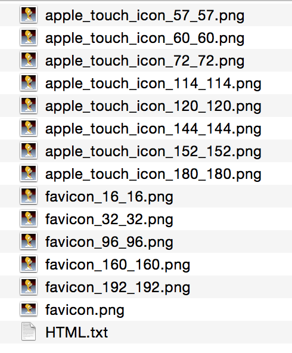

# AppleTouchIconGenerator  
This is a mac command line tool to generate the apple-touch-icon and its HTML code for websites  
The generated files are like this:  
  
By providing an image as the source icon, this tool will generate png icons with different sizes you specified, then it will generate a text file contain the HTML code like this which you can paste to your page immediately.  
```HTML
<link rel="apple-touch-icon" sizes="57x57" href="/apple_touch_icon_57_57.png" />
<link rel="apple-touch-icon" sizes="114x114" href="/apple_touch_icon_114_114.png" />
<link rel="apple-touch-icon" sizes="72x72" href="/apple_touch_icon_72_72.png" />
<link rel="apple-touch-icon" sizes="144x144" href="/apple_touch_icon_144_144.png" />
<link rel="apple-touch-icon" sizes="60x60" href="/apple_touch_icon_60_60.png" />
<link rel="apple-touch-icon" sizes="120x120" href="/apple_touch_icon_120_120.png" />
<link rel="apple-touch-icon" sizes="152x152" href="/apple_touch_icon_152_152.png" />
<link rel="apple-touch-icon" sizes="180x180" href="/apple_touch_icon_180_180.png" />
<link rel="icon" type="image/png" sizes="16x16" href="/favicon_16_16.png" />
<link rel="icon" type="image/png" sizes="32x32" href="/favicon_32_32.png" />
<link rel="icon" type="image/png" sizes="96x96" href="/favicon_96_96.png" />
<link rel="icon" type="image/png" sizes="160x160" href="/favicon_160_160.png" />
<link rel="icon" type="image/png" sizes="192x192" href="/favicon_192_192.png" />
```

